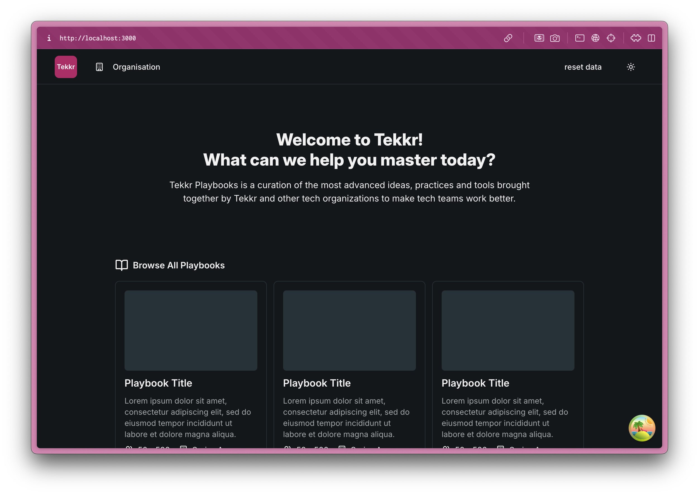

# Tekkr Coding Challenge

## Getting Started

### Setup

This repository has everything in place that you need to get started quickly.
You need to:
- Have Node.js installed (v16 or above)
- Clone this repository
- Run `npm install`
- Run `npm start` - this should launch the application in your browser. (it runs at [http://localhost:3000](http://localhost:3000))

### The Application

The app that you will be working on is a very stripped down version of Tekkr's actual product.
It consists of a home page (with some dummy links to playbooks) and an organization page used to manage the organization in an account.

At the top, there's a navigation bar that allows you to navigate the two pages, switch dark/light mode or reset the data of the application.

## The Challenge

### Your task

Start by running the application and familiarizing yourself with it.

On the organisation page, there is a button that says "Add Member", currently nothing happens when you click it but your job is to implement the dialog window that opens when the button is clicked.

You can find a rudimentary ticket describing what's needed on this page: [https://tekkr.notion.site/hiring-challenge-ticket](https://tekkr.notion.site/hiring-challenge-ticket)

The "backend" for creating users already exists.
There is a singleton called `apiClient` that has a function called `createUser` - use this function to create the member when the *Save* button is pressed.
You should treat this as the backend for the application and assume that it talks to a remote server.

### What's important

You should keep the following things in mind while building the dialog:

- Everything should look and feel nice, use the components provided in the repository.
- Make sure the dialog behaves correctly while loading or when the "backend call" fails.
- The user input should be validated correctly.
- Think about what happens before and after the dialog is used.

### How to work with the existing code

- You can do pretty much whatever you want, the only thing that's out of bounds is changing the `mock-backend.ts` file.
- Feel free to add additional dependencies if you think it makes sense.
- We use the ui components from [shadcn](https://ui.shadcn.com/). You can find them in `src/components/ui`. All components you need are already installed. Their website has a bunch of examples showing how to use the components.
- For querying and mutating data we use [TanStack Query](https://tanstack.com/query/latest). It too is already installed, please use it.